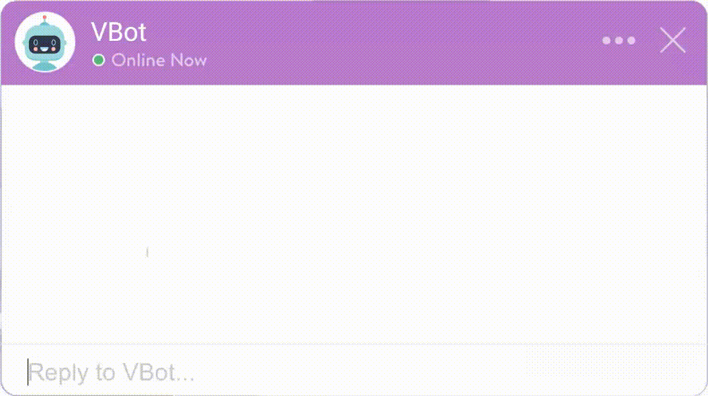

# Rasa-Unity
This is a tutorial to show how one can integrate Rasa chatbots with Unity.


## Installation
First, clone this repo using `git clone https://github.com/codemaker2015/Rasa-Unity`

### Rasa
- Change directory into `Rasa/` and create a virtual environment using  
```
python -m venv venv
```
- Activate the virtual environment  
Windows : `venv/Scripts/activate`    
Linux : `source venv/bin/activate`
- Upgrade pip
```
python -m pip install --upgrade pip
```
- Install Rasa into the virtual environment 
```
pip install rasa==2.7.1
```
- Initialize rasa chatbot
```
rasa init
```
- Run the rasa server 
```
rasa run -m models --enable-api --cors "*"
```
- For training the model
```
rasa train --config config.yml --domain domain.yml --data data/
```

### Unity
- The Unity project was made using 2019.3 hence is the recommended version.
- Open Unity Hub and choose "Add" from top right corner.
- Select the Unity project folder located in Rasa-Unity/Unity/Rasa.
- Press play __after__ running the Rasa server.
- Type your message and the bot should respond.
